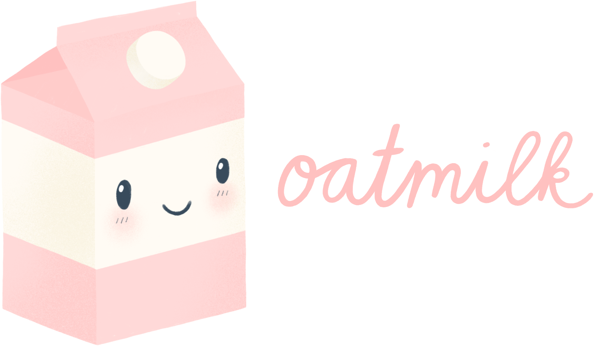

# oatmilk

[](https://github.com/prettier/prettier)
[](https://github.com/bitttttten/oatmilk/releases)
[](https://github.com/bitttttten/oatmilk/compare/v2.0.0...master)
[](https://www.npmjs.com/package/oatmilk)

## Introduction

oatmilk is a minimal, decoupled, routing library for React.

✅ SSR Friendly

✅ Flexible

✅ Testable

✅ [Decoupled](#decoupled)

## Docs

-   [Server rendering](https://github.com/bitttttten/oatmilk/blob/master/docs/server-rendering.md)
-   [Typescript](https://github.com/bitttttten/oatmilk/blob/master/docs/typescript.md)
-   [Using Context](https://github.com/bitttttten/oatmilk/blob/master/docs/using-context.md)

## Instructions

### Install

`yarn add oatmilk`

### Wrap your App with your routes

You must included a route with a name of `notFound` since this is the fallback route.

```js App.tsx
import oatmilk, { IRoutes } from 'oatmilk'

const routes: oatmilk.IRoute[] = [
    {
        name: 'home',
        path: '/',
        // send in any react node
        view: () => <p>The world never says hello back..</p>,
    },
    {
        name: 'user',
        path: '/user/:id',
        // use React.lazy to help with code splitting
        view: React.lazy(() => import('./Pages/User.tsx')),
    },
    {
        name: 'notFound',
        path: '/404',
        // or use @loadable/component for SSR support
        view: loadable(() => import('./Pages/NotFound.tsx')),
    },
]

ReactDOM.render(
    <oatmilk.Provider routes={routes}>
        <App />
    </oatmilk.Provider>,
    document.getElementById('root'),
)
```

### Render a RouterView

The `RouterView` will render the current route's `view`

```js App.tsx
export function App() {
    return (
        <>
            <Navigation />
            <Header />
            <oatmilk.RouterView />
            <Footer />
        </>
    )
}
```

### Render some links

No need to generate the paths here, oatmilk will find the route and generate a path for you that is derived from the state.

```js App.tsx
function Navigation() {
    return (
        <>
            <oatmilk.Link routeName='home'>Go home</oatmilk.Link>
            <oatmilk.Link routeName='user' state={{ user: 'bitttttten' }}>
                Go to my page
            </oatmilk.Link>
        </>
    )
}
```

## API

### Transition Hooks

oatmilk has 2 transition hooks: onEnter, and onBeforeEnter. You can use it for the global routing context, and also for a single route's context.

```js routes.tsx
import oatmilk, { IRoute, TRouteState } from 'oatmilk'

export const routes: IRoutes = [
    {
        name: 'home',
        path: '/',
        view: HomePage,
        onEnter: (route: IRoute, state: TRouteState) => {
            console.log('I am called as you enter only the home route')
            ArticlesStore.fetchTrendingArticles()
            TodoStore.fetchTodos()
        },
        onExit: (route: IRoute, state: TRouteState) => {
            console.log('I am called as you exit only the home route')
        },
    },
    {
        name: 'user'
        path: '/user/:slug',
        view: UserPage,
        onEnter: (route: IRoute, state: TRouteState) => {
            UserStore.fetchUserById(state.id)
        },
    },
]

function onEnter(route: IRoute, state: TRouteState) {
    console.log('I am called as you enter any route')
    analytics.logPageView()
}

function onExit(route: IRoute, state: TRouteState) {
    console.log('I am called as you exit any route')
}

ReactDOM.render(
    <oatmilk.RouterProvider routes={routes} onEnter={onEnter} onExit={onExit}>
        <App />
    </oatmilk.RouterProvider>,
    document.getElementById('root'),
)
```

### Hook callee

oatmilk ships with a way to customise how the above hooks are called with a `hookCallee` function. Use this method to inject your own callee to completely customise the transition hooks. This can help with server side rendering by passing in a store on the server and client. Learn about that in [the server rendering docs](https://github.com/bitttttten/oatmilk/blob/master/docs/server-rendering.md).

## Decoupled

oatmilk is state first, and everything else is derived from this. The current route is held in state and effects like updating the URL, are managed after the fact.

Decoupling your state and data fetching from your view helps you keep a declarative approach to your codebase. It also makes reasoning and testing simplier, and greatly reduces the complexity of server rendering and pre-fetching data.

## Credits

Thanks to [probablyup](https://github.com/probablyup)'s [buttermilk](https://github.com/probablyup/buttermilk), which was a project I found after writing the first draft of oatmilk which inspired a lot of changes and inspiration.. and of course the name.

Made possible by

<a href="https://soulpicks.com" target="_blank"></a>
